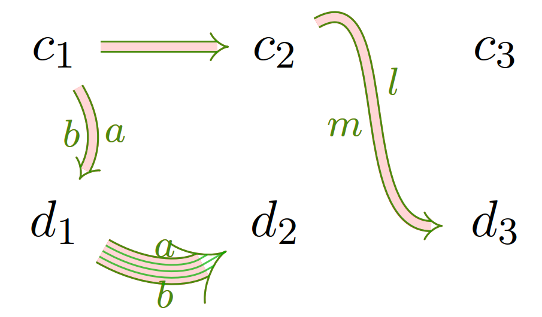

# tikz-nfold – higher order paths in TikZ

This library adds higher-order paths to [TikZ][pgf] and also fixes some graphical issues with TikZ' `double` paths, used e.g. in wide arrows. It is also compatible with [tikz-cd][tikz-cd], adding support for triple and higher arrows. See the [documentation](tikz-nfold-doc.pdf) for full details.

This package is available on [CTAN](https://ctan.org/pkg/tikz-nfold). Availability on MiKTeX and TeX Live is in the works.

[pgf]: https://ctan.org/pkg/pgf
[tikz-cd]: https://ctan.org/pkg/tikz-cd

## Installation

All files except `tikz-nfold-doc.tex` and `tikz-nfold-doc.pdf` should be installed in the `tex` folder.

## License

This work may be distributed and/or modified under the conditions of the LaTeX Project Public License, either version 1.3c of this license or (at your option) any later version.

## Impressions

